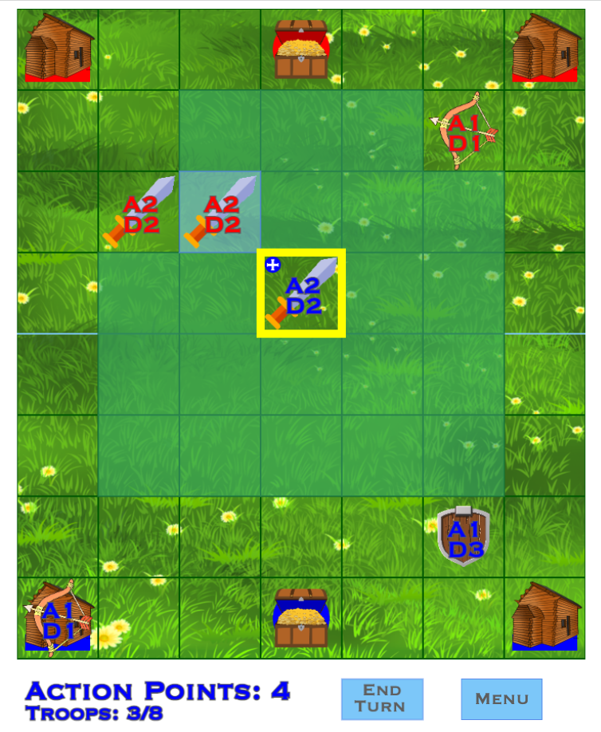

|| Treasure Wars! ||\
---Background---\
Treasure Wars! is a 2 player turn-based strategy game in which the 2 players will play against eachother, and attempt to capture the treasure chest from the opponent's base and bring it back to their own base.\
[Click here to play!](https://jasminekobata.github.io/Javascript-Project/)

---Gameplay--\
| BUYING |\
Each team has two barracks that can generate new units, with a total maximum of 8 units.
There are 3 different types of units that can be spawned, as follows:

- Infantry:	Defense 2, Attack 2, Attack Range 1
- Archer:	Defense 1, Attack 1, Attack Range 2
- Infantry:	Defense 3, Attack 1, Attack Range 1

| MOVING |\
All units can move 2 squares in any direction

| UPGRADING |\
Each unit can be upgraded when in enemy territory, as follows:

- Infantry:	Defense +1, Attack +2
- Archer:	Defense +1, Attack +1
- Infantry:	Defense +2, Attack +1

Upgrading will restore any lost unit defense points. Units cannot attack after upgrading until the next round. Stats will revert to their original state once returning to friendly territory.

| TREASURE |\
The treasure is picked up by moving a unit onto the square containing it. Units can only pick up enemy treasure.

| Price Chart |\
Moving:		1 Action Point\
Attacking:	1 Action Point\
Buying:		2 Action Points\
Upgrading:	2 Action Points

---Features---\
PATHFINDING\
Unit pathfinding was implemented using recursion
```
getMoves(visited = new Set(), maxDist = 2, pos = this.pos) {
    if (maxDist === 0) { return visited; }

    for (let y=pos.y-1; y <= pos.y + 1; y++) {
        for (let x=pos.x-1; x <= pos.x + 1; x++) {
            let newPos = {y: y, x: x};
            //if newPos is on the board and does not contain a unit
            if (isOnBoard(newPos) && !this.hasUnit(newPos)) {
                if (!visited.has(newPos)) {
                    visited.add(newPos);
                }
                visited = this.getMovesSet(visited, maxDist-1, newPos);
            }
        }
    }

    return visited;
}
```

STATE MACHINE\
State machine implemented to keep track of game states & actions taken by the player
```
    stateMachine() {
        //get grid square that was clicked on
        let square = this.board.grid.get(this.stateVariables.clickedPos);
        switch (this.state) {
            case 'unselected':
                //if unit upgrade is selected
                if (this.unitUpgradeable(this.stateVariables, square)) {
                    this.state = 'upgrade';
                } //if unit is selected
                else if (this.unitSelected(square)) {
                    this.state = 'unit';
                } //else if barrack is selected
                else if (this.barrackSelected(square)) {
                    this.state = 'barrack';
                }
                break;
            case 'unit':
                //if action taken
                if (this.actionTaken(this.stateVariables)) {
                    this.state = 'unselected';
                } //else if action not taken
                else {
                    if (this.unitUpgradeable(this.stateVariables, square)) {
                        this.state = 'upgrade'
                    }
                    else if (this.unitSelected(square)) {
                    	//stay in unit state
                    }
                    else if (this.barrackSelected(square)) {
                        this.state = 'barrack';
                    }
                    else {
                        this.state = 'unselected';
                    }
                }
                break;
            case 'barrack':
                //if unit is bought
                if (this.unitBought(this.stateVariables)) {
                    this.state = 'unselected';
                } //else if unit is not bought
                else {
                    if (this.unitUpgradeable(this.stateVariables, square)) {
                        this.state = 'upgrade'
                    }
                    else if (this.unitSelected(square)) {
                        this.state = 'unit';
                    }
                    else if (this.barrackSelected(square)) {
                        //stay in barrack state
                    } else {
                        this.state = 'unselected';
                    }
                }
                break;
            case 'upgrade':
                //if unit is upgraded
                if (this.unitUpgraded(this.stateVariables)) {
                    this.state = 'unselected';
                } //else if unit is not upgraded
                else {
                    if (this.unitUpgradeable(this.stateVariables, square)) {
                    	//stay in upgrade state
                    }
                    else if (this.unitSelected(square)) {
                        this.state = 'unit';
                    }
                    else if (this.barrackSelected(square)) {
                        this.state = 'barrack';
                    } else {
                        this.state = 'unselected';
                    }
                }
                break;
            default:
                console.log("ERROR: undefined state");
        }
```


---Technologies, Libraries, APIs---\
This project was implemented using the following:

- Canvas API
- Webpack
- npm

--Future Updates--
- Animations for moving/ugrading/attacking
- Tutorial Mode
- AI for solo play
- Sockets for remote multiplayer
