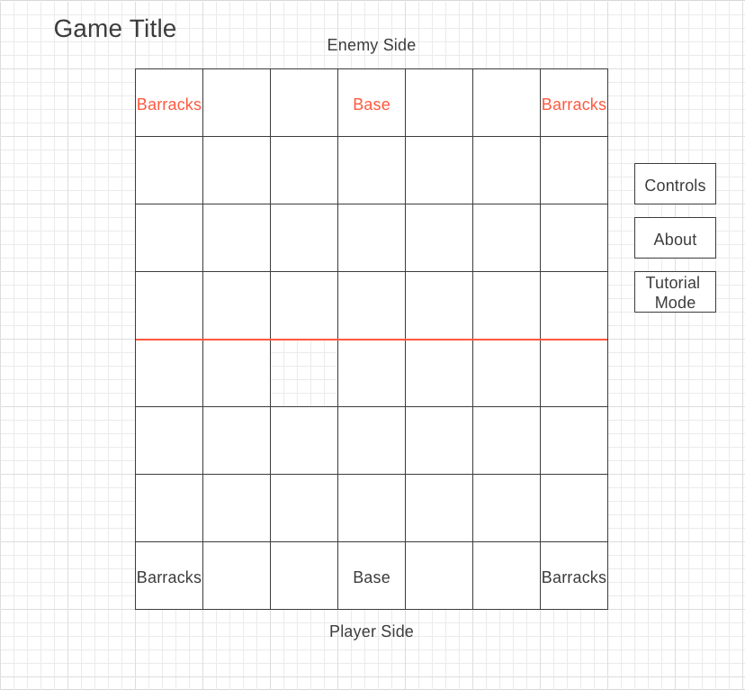

|| Treasure Wars! ||\
---Background---\
Treasure Wars! is a 2 player turn-based strategy game in which the player will play against the computer, and attempt to capture the treasure chest from the opponent's base and bring it back to their own base. Each team will have two barracks that can generate new units, with a tentative total maximum of 8 units.\
There will be 3 different types of units that can be spawned, each with different attack and defense weights. When a unit is in enemy territory, the unit can be ugraded for improved stats. The unit stats will be reverted once returning to the player's own side. For each round, the player will recieve a set number of action points (tentatively 4), with each action (moving, spawning, attacking, upgrading) costing either 1 or 2 points.

---Functionality & MVPs---
In Treasure Wars!, users will be able to:
- Generate units (2 action points). There will be 3 types of units:
	- Infantry, with a defense of 2, attack of 2, and attack distance of 1
	- Archer, with a defense of 1, attack of 1, and attack distance of 2
	- Defender, with a defense of 3, attack of 1, and attack distance of 1
- Move units (1 action point). All units are able to move 1 or 2 spaces in any direction, unless blocked by another piece.
- Attack other units (1 action point). The attacked unit will lose the same number of defense points as the attacker's attack points.
- Upgrade units (2 action points). When in enemy territory, the 3 units can be upgraded as follows (highly tentative):
	- Infantry, +1 defense, +2 attack
	- Archer, +1 defense, +1 attack
	- Defender, +2 defense, +1 attack
- Pick up the treasure chest (1 action point). The treasure chest is collected by moving a unit onto the square where the chest is. The game is won when the opponent's chest is brought to the player's base square.

In addition, this project will include:
- Two unit generation squares and a base
- A rules button describing how to play when clicked
- A production README

---Wireframes---

- Controls button displays the rules of the game in text form
- About will contain the project's Github repo and a link to my linkedin
- Tutorial mode will guide the player through a small demo explaining all the rules and possible actions (bonus)
- At the start of the game, the player barracks will prompt the user to select which two units to start with, and will display three icons representing the units for the player to select from.

---Technologies, Libraries, APIs---
This project will be implemented using the following:
- Canvas API
- Webpack
- npm

---Implementation Timeline---
Friday & Weekend
- Set up Models. Set up project & webpack. Create Board, Barracks, Base, & unit classes with basic movement. Render the Board to the canvas with the starting pieces in place.

Monday
- Set up Views basics & Controllers. Ensure that controller conveys clicks to the model. Ensure that model updates piece position correctly.

Tuesday
- Model will enforce correct game logic. Pieces will move and attack the correct spaces, & be able to upgrade, capture treasure, spawn, etc. Implement AI for the enemy team.

Wednesday
- Enhance Views. Full user selection views, adding sprites. Implement bonuses if time.

Thursday
- Final touches. Deploy to GitHub.

---Bonuses---
- Add tutorial mode
- Add animated radial user selection menus
- Add multiplayer option